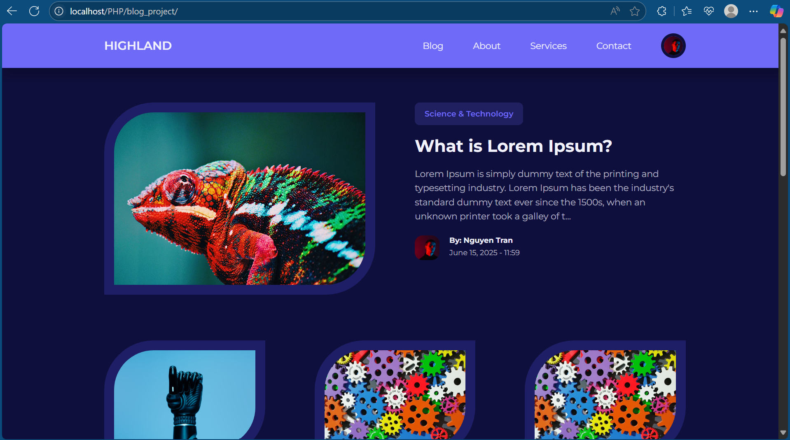

# FULL-STACK BLOG PROJECT WITH PHP ONLY

## Introduction
This is a website that allows users to interact with posts and have basic CRUD. In addition, it provides additional user management and category management rights for the admin.

## Main functions
- Login/Register
- CRUD for posts
- CRUD for users (admin)
- CRUD for categories
- Display posts and can filter by category or title
- Responsive

## How to run
- Install XAMPP and clone the project to your local repo (root of XAMPP)
- Import the database
- Run Apache and MySQL
- Open the root directory with a web browser
